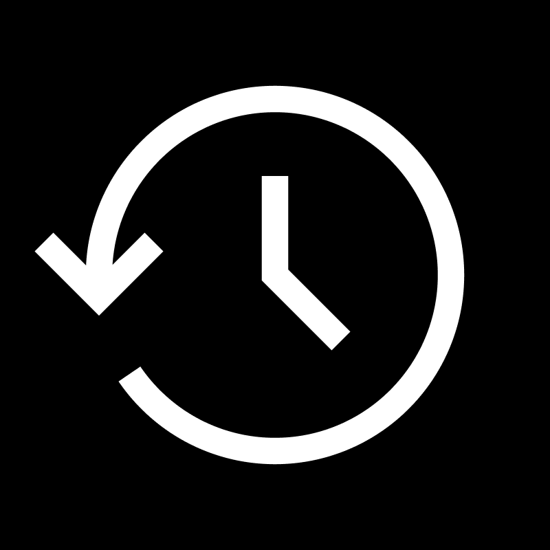

<div align="center">

# 🧠 QuickBrain for PowerToys Run


### ⚡ Smart Calculator with AI-Powered Intelligence ⚡

**Never leave your workflow for calculations again.**  
Access advanced math, unit conversions, date calculations, and AI assistance instantly with `Alt+Space` → `qb sin(pi/4)` → Done! ✨

<!-- Badges -->
<a href="https://github.com/ruslanlap/PowerToysRun-QuickBrain/actions/workflows/build-and-release.yml"></a>
<a href="https://github.com/ruslanlap/PowerToysRun-QuickBrain/releases/latest">
  
</a>


<a href="https://github.com/ruslanlap/PowerToysRun-QuickBrain/stargazers">
  
</a>
<a href="https://github.com/ruslanlap/PowerToysRun-QuickBrain/issues">
  
</a>
<a href="https://github.com/ruslanlap/PowerToysRun-QuickBrain/releases/latest">
  
</a>


<a href="https://opensource.org/licenses/MIT">
  
</a>

</div>

<div align="center">
  <a href="https://github.com/ruslanlap/PowerToysRun-QuickBrain/releases/download/v1.0.0/QuickBrain-1.0.0-x64.zip">
    
  </a>
  <a href="https://github.com/ruslanlap/PowerToysRun-QuickBrain/releases/download/v1.0.0/QuickBrain-1.0.0-arm64.zip">
    
  </a>
</div>

## 📊 Download Statistics

<div align="center">
  
</div>

---

## 🎯 Why Developers Love QuickBrain

<div align="center">

**"Stop switching between calculator apps and browser tabs"**

| ❌ Before | ✅ With QuickBrain |
|-----------|-----------------|
| Open calculator → Type → Copy → Switch back | `Alt+Space` → `qb sin(pi/4)` → Copy |
| 15+ seconds, context switching | **2 seconds, zero interruption** |

</div>

### 🚀 **Quick Demo** - Try it now:
```
Alt+Space → qb 2+2                    # 🧮 Basic math
Alt+Space → qb 100 km to miles        # 🔄 Unit conversion  
Alt+Space → qb bmi 180cm 75kg         # 💪 Health calculations
Alt+Space → qb ai explain recursion   # 🤖 AI assistance
```

<div align="center">
  
  
  
  
  
  **⬇️ Ready to boost your productivity?**
  
  <a href="https://github.com/ruslanlap/PowerToysRun-QuickBrain/releases/download/v1.0.0/QuickBrain-1.0.0-x64.zip">
    
  </a>
  <a href="https://github.com/ruslanlap/PowerToysRun-QuickBrain/releases/download/v1.0.0/QuickBrain-1.0.0-arm64.zip">
    
  </a>
</div>

## 🧭 Table of Contents

- [Overview](#-overview)
- [Features](#-features-that-matter)
- [Demo Gallery](#-demo-gallery)
- [Quick Start](#-get-started-in-60-seconds)
- [Usage Examples](#-power-user-commands)
- [Configuration](#-advanced-configuration)
- [AI Integration](#-ai-integration)
- [History Management](#-history-management)
- [Building from Source](#-for-developers)
- [Project Structure](#-project-structure)
- [FAQ](#-faq)
- [Troubleshooting](#-troubleshooting)
- [Security & Privacy](#-privacy--security)
- [Tech Stack](#-tech-stack)
- [Contributing](#-contributing)
- [Support the Project](#-community--support)
- [License](#-license)
- [Acknowledgements](#-acknowledgements)

## 📝 Overview

**QuickBrain** is a powerful smart calculator plugin for PowerToys Run that combines advanced mathematical computations, unit conversions, date calculations, and optional AI-powered natural language processing. Get instant results without leaving your workflow.

- **Plugin ID:** `36FD3BCBE8684A548E91C95315804782`
- **Action Keyword:** `qb` (customizable)
- **Platform:** Windows 10/11 (x64, ARM64)
- **Tech:** C#/.NET 9.0, WPF, PowerToys Run API
- **Offline-First:** All core features work without internet

---

## ⚡ Features That Matter

<div align="center">
<table>
<tr>
<td align="center" width="33%">

<br><b>🧮 Advanced Math</b><br>
<sub>Arithmetic, trigonometry,<br>logarithms, statistics</sub>
</td>
<td align="center" width="33%">

<br><b>🔄 Unit Conversions</b><br>
<sub>Length, weight, temperature,<br>volume, data, speed</sub>
</td>
<td align="center" width="33%">

<br><b>📅 Date Calculations</b><br>
<sub>Date arithmetic, differences,<br>relative dates</sub>
</td>
</tr>
<tr>
<td align="center" width="33%">

<br><b>🔢 Logic Evaluation</b><br>
<sub>Boolean logic, bitwise<br>operations, truth tables</sub>
</td>
<td align="center" width="33%">

<br><b>🤖 AI Streaming</b><br>
<sub>Real-time AI responses<br>with multiple providers</sub>
</td>
<td align="center" width="33%">

<br><b>📜 History Management</b><br>
<sub>Track and search<br>previous calculations</sub>
</td>
</tr>
<tr>
<td align="center" width="33%">

<br><b>💪 Health Calculations</b><br>
<sub>BMI calculator and<br>health metrics</sub>
</td>
<td align="center" width="33%">

<br><b>💰 Money Calculations</b><br>
<sub>Tip calculator,<br>percentage calculations</sub>
</td>
</tr>
</table>
</div>

---

## 📸 Demo Gallery

<div align="center">

### Mathematical Operations


**Examples:** `2+2`, `sin(pi/4)`, `sqrt(144)`, `log10(1000)`

### Unit Conversions


**Examples:** `100 km to miles`, `70 kg to pounds`, `32 F to C`

### AI Assistance


**Examples:** `ai explain quantum computing`, `ask what is recursion`

### Date Calculations


**Examples:** `days between 2024-01-01 and 2024-12-31`, `today + 7 days`

</div>

---

## 🏃‍♂️ Get Started in 60 Seconds

### 1️⃣ **Download & Extract** (15 seconds)
```bash
# Choose your architecture from releases
# https://github.com/ruslanlap/PowerToysRun-QuickBrain/releases/latest
```

### 2️⃣ **Auto-Install Location** (30 seconds)
```
%LOCALAPPDATA%\Microsoft\PowerToys\PowerToys Run\Plugins\QuickBrain
```

### 3️⃣ **Restart PowerToys** (15 seconds)
Right-click PowerToys tray icon → Exit → Restart from Start Menu

### 4️⃣ **Start Calculating** 🎯
1. Hit `Alt+Space` to open PowerToys Run
2. Type `qb 2+2` → See result instantly
3. Press Enter to copy result to clipboard
4. Try more: `qb 100 km to miles`, `qb bmi 180cm 75kg`

> **Pro Tip:** Change the keyword from `qb` to `calc` or `c` in PowerToys settings for even faster access!

---

## 💡 Power User Commands

<div align="left">

### 🧮 Mathematical Operations

#### Basic Arithmetic
```bash
qb 2 + 2                    # Addition: 4
qb 10 - 3                   # Subtraction: 7
qb 5 * 6                    # Multiplication: 30
qb 15 / 3                   # Division: 5
qb 2 ^ 8                    # Exponentiation: 256
qb 20% of 500              # Percentage: 100
qb sqrt(25)                 # Square root: 5
qb cbrt(27)                 # Cube root: 3
```

#### Advanced Mathematics
```bash
qb sin(pi/4)                # Trigonometric: 0.7071
qb cos(60)                  # Cosine (degrees): 0.5
qb tan(45)                  # Tangent: 1
qb log(100)                 # Natural logarithm: 4.6052
qb log10(1000)              # Base-10 logarithm: 3
qb exp(2)                   # Exponential: 7.3891
qb abs(-5.5)                # Absolute value: 5.5
qb floor(3.7)               # Floor: 3
qb ceil(3.2)                # Ceiling: 4
qb round(3.14159, 2)        # Round to 2 decimals: 3.14
```

#### Statistics
```bash
qb mean([1,2,3,4,5])        # Mean: 3
qb median([1,3,5,7,9])      # Median: 5
qb mode([1,2,2,3,4])        # Mode: 2
qb stddev([1,2,3,4,5])      # Standard deviation: 1.5811
qb variance([1,2,3,4,5])    # Variance: 2.5
```

### 🔄 Unit Conversions

#### Length
```bash
qb 100 cm to inches         # 39.3701 inches
qb 5 miles to km            # 8.04672 km
qb 10 feet to meters        # 3.048 meters
qb 1000 yards to miles      # 0.568182 miles
```

#### Weight
```bash
qb 70 kg to pounds          # 154.324 pounds
qb 200 lbs to kg            # 90.7185 kg
qb 1000 g to ounces         # 35.274 ounces
qb 2 tons to kg             # 2032.09 kg
```

#### Temperature
```bash
qb 32 F to C                # 0 Celsius
qb 100 C to F               # 212 Fahrenheit
qb 0 K to C                 # -273.15 Celsius
qb 25 C to K                # 298.15 Kelvin
```

#### Volume
```bash
qb 1 gallon to liters       # 3.78541 liters
qb 500 ml to cups           # 2.11338 cups
qb 2 liters to quarts       # 2.11338 quarts
```

#### Data Storage
```bash
qb 1 GB to MB               # 1024 MB
qb 1000 MB to GB            # 0.976562 GB
qb 1 TB to bytes            # 1099511627776 bytes
```

### 📅 Date Calculations

```bash
qb days between 2024-01-01 and 2024-12-31    # 365 days
qb weeks between 2024-01-01 and 2024-06-30   # 26 weeks
qb months between 2020-01-01 and 2024-01-01  # 48 months
qb 2024-01-01 + 30 days                     # 2024-01-31
qb 2024-12-31 - 90 days                     # 2024-10-02
qb today + 7 days                           # Current date + 7 days
qb now + 2 hours                            # Current time + 2 hours
```

### 🔢 Logic Evaluation

```bash
qb true AND false           # false
qb true OR false            # true
qb NOT true                 # false
qb true XOR false           # true
qb 5 > 3 AND 2 < 4         # true
qb (true OR false) AND true # true
qb 5 & 3                    # Bitwise AND: 1
qb 5 | 3                    # Bitwise OR: 7
qb 5 ^ 3                    # Bitwise XOR: 6
```

### 💪 Health Calculations

```bash
qb bmi 180cm 75kg           # BMI: 23.15 (Normal weight)
qb bmi 5'11" 165lbs         # BMI: 23.01 (Normal weight)
```

### 💰 Money Calculations

```bash
qb tip 10% 450              # Tip: $45.00, Total: $495.00
qb tip 15% 85.50            # Tip: $12.83, Total: $98.33
qb tip 20% 120              # Tip: $24.00, Total: $144.00
```

### 🤖 AI Streaming (Optional)

```bash
qb ai explain recursion                      # Get AI explanation
qb ai what is the speed of light            # Ask questions
qb ask how does blockchain work             # Alternative keyword
qb ai write a python function to sort       # Code generation
```

### 📜 History Management

```bash
qb history                  # View calculation history
qb history clear            # Clear all history
qb history open             # Open history.json file
qb history sqrt             # Search history for "sqrt"
```

</div>

<details>
<summary><b>🎨 See All Available Features</b></summary>

- **Real-time Results**: Instant calculation as you type
- **Context Menu**: Right-click results for:
  - Copy result (Ctrl+C)
  - Copy input
  - Explain via AI (when enabled)
  - View in History
  - Open Settings
- **Theme Support**: Automatic dark/light mode icons
- **Offline-First**: Core features work without internet
- **Configurable Precision**: 0-28 decimal places
- **Angle Units**: Radians, Degrees, or Gradians
- **History Persistence**: Automatic calculation tracking
- **Multi-language Support**: Works with any language input

</details>

## 🔧 Advanced Configuration

<details>
<summary><b>⚙️ Customize Your Experience</b></summary>

### Settings File Location
Settings are stored in `settings.json` in the plugin directory:
```
%LOCALAPPDATA%\Microsoft\PowerToys\PowerToys Run\Plugins\QuickBrain\settings.json
```

### Basic Settings

- **MaxResults**: Maximum number of results to display (1-20, default: 5)
- **Precision**: Decimal precision for calculations (0-28, default: 10)
- **AngleUnit**: Unit for trigonometric functions (Radians/Degrees/Gradians, default: Radians)
- **Theme**: UI theme (Auto/Light/Dark, default: Auto)

### History Settings

- **EnableHistory**: Enable calculation history (default: true)
- **HistoryLimit**: Maximum history entries (0-1000, default: 100)

### AI and Natural Language Settings

- **EnableNaturalLanguage**: Enable NLP query understanding (default: false)
- **EnableAIParsing**: Enable AI-powered query parsing (default: false)
- **EnableAiCalculations**: Enable AI-powered calculations (default: false)
- **AiTimeout**: AI API timeout in milliseconds (1000-60000, default: 3000)
- **OfflineFirst**: Try offline methods before AI (default: true)

### Example Configuration File

```json
{
  "maxResults": 5,
  "precision": 10,
  "angleUnit": "Radians",
  "theme": "Auto",
  "enableHistory": true,
  "historyLimit": 100,
  "enableNaturalLanguage": false,
  "enableAiParsing": false,
  "enableAiCalculations": false,
  "aiProvider": "OpenAI",
  "openAiApiKey": "",
  "openAiModel": "gpt-4",
  "aiTimeout": 3000,
  "offlineFirst": true
}
```

### Accessing Settings
Right-click any result → **Open Settings** to edit the configuration file directly.

</details>

---

## 🤖 AI Integration

<details>
<summary><b>🔑 AI Provider Configuration</b></summary>

QuickBrain supports multiple AI providers for natural language processing and streaming responses:

### Supported Providers

| Provider | Features | API Key Required |
|----------|----------|------------------|
| **OpenAI** | GPT-4, GPT-3.5 | Yes |
| **Anthropic** | Claude 3 | Yes |
| **HuggingFace** | Open models | Yes |
| **OpenRouter** | Multiple providers | Yes |

### Getting API Keys

#### OpenAI
1. Visit [OpenAI Platform](https://platform.openai.com/)
2. Create an account or sign in
3. Navigate to API Keys section
4. Create a new API key
5. Copy the key and add it to your settings

#### Anthropic
1. Visit [Anthropic Console](https://console.anthropic.com/)
2. Create an account or sign in
3. Navigate to API Keys section
4. Create a new API key
5. Copy the key and add it to your settings

#### HuggingFace
1. Visit [Hugging Face](https://huggingface.co/)
2. Create an account or sign in
3. Navigate to Settings → Access Tokens
4. Create a new token with read permissions
5. Copy the token and add it to your settings

#### OpenRouter
1. Visit [OpenRouter](https://openrouter.ai/)
2. Create an account or sign in
3. Navigate to API Keys section
4. Create a new API key
5. Copy the key and add it to your settings

### Configuration Examples

#### OpenAI Configuration
```json
{
  "aiProvider": "OpenAI",
  "openAiApiKey": "sk-your-api-key-here",
  "openAiModel": "gpt-4",
  "enableAiCalculations": true
}
```

#### Anthropic Configuration
```json
{
  "aiProvider": "Anthropic",
  "anthropicApiKey": "your-anthropic-api-key-here",
  "anthropicModel": "claude-3-sonnet-20240229",
  "enableAiCalculations": true
}
```

#### HuggingFace Configuration
```json
{
  "useHuggingFace": true,
  "huggingFaceApiKey": "your-huggingface-api-key-here",
  "huggingFaceModel": "microsoft/DialoGPT-medium",
  "enableAiCalculations": true
}
```

#### OpenRouter Configuration
```json
{
  "useOpenRouter": true,
  "openRouterApiKey": "your-openrouter-api-key-here",
  "openRouterModel": "meta-llama/llama-3.3-70b-instruct",
  "enableAiCalculations": true
}
```

### AI Streaming Features

- **Real-time Responses**: Watch AI responses appear token-by-token
- **Context Menu Actions**: 
  - Copy full response
  - Restart query
  - Show full response
- **Configurable Timeout**: Adjust response time limits (1-60 seconds)
- **Fallback Support**: Automatic retry with secondary providers

### Security Note

- API keys are stored in plain text in settings.json
- Use API keys with limited permissions or quotas
- Do not use production or billing-critical keys
- Consider rotating keys periodically
- Avoid sharing your settings.json file

</details>

---

## 📜 History Management

<details>
<summary><b>📚 Track Your Calculations</b></summary>

QuickBrain automatically tracks all your calculations with convenient management features:

### History Features

- **Automatic Storage**: All successful calculations are saved automatically
- **FIFO Management**: Oldest entries are removed when the limit is reached
- **Persistent Storage**: History is saved to `%AppData%\PowerToys\QuickBrain\history.json`
- **Search Capability**: Quickly find previous calculations
- **Context Actions**: Right-click any history entry for options

### History Commands

```bash
qb history              # View recent calculations (up to 20)
qb history clear        # Remove all history
qb history open         # Open history.json file
qb history <term>       # Search history for specific term
```

### History Entry Information

Each history entry includes:
- Original expression/query
- Calculated result
- Calculation type (math, conversion, date, etc.)
- Timestamp
- Title and subtitle

### Context Menu Actions

Right-click any history entry to:
- **Copy Result**: Copy the result to clipboard
- **Copy Input**: Copy the original expression
- **Explain via AI**: Get an AI explanation (when AI enabled)
- **View in History**: Navigate to history view

### Configuration

Control history behavior in settings:
```json
{
  "enableHistory": true,
  "historyLimit": 100
}
```

- Set `historyLimit` to 0 to disable automatic history
- Maximum limit is 1000 entries
- History file is automatically created if it doesn't exist

</details>

---

## 🏗️ For Developers

### 🚀 **Quick Build**
```bash
git clone https://github.com/ruslanlap/PowerToysRun-QuickBrain.git
cd PowerToysRun-QuickBrain
./build-and-zip.sh  # Creates distribution-ready packages
```

### 📦 **Build from Source**

#### Prerequisites
- .NET 9.0 SDK
- Visual Studio 2022 or VS Code
- Git
- Windows 10/11

#### Build Steps

```bash
# Restore dependencies
dotnet restore QuickBrain/QuickBrain.sln

# Build in Release mode
dotnet build QuickBrain/QuickBrain.sln --configuration Release

# Run tests
dotnet test QuickBrain/QuickBrain.sln

# Package manually (if needed)
mkdir -p package/QuickBrain
cp QuickBrain/Community.PowerToys.Run.Plugin.QuickBrain/bin/Release/net9.0-windows10.0.22621.0/* package/QuickBrain/
cd package && zip -r ../QuickBrain-v1.0.0.zip .
```

#### Using Build Script

**Linux/macOS:**
```bash
chmod +x build-and-zip.sh
./build-and-zip.sh
```

**Windows:**
```batch
build-and-zip.bat
```

### 🧪 **Tech Stack**
- **Runtime**: .NET 9.0 with Windows 10/11 target  
- **UI**: WPF with theme-aware design
- **HTTP**: HttpClient with streaming support
- **Architecture**: Service-oriented with clean separation
- **Serialization**: System.Text.Json for API responses
- **Testing**: xUnit framework

### 🎯 **Project Highlights**  
- **Clean Code**: Well-documented, testable architecture
- **Multi-Platform**: x64 + ARM64 builds
- **Streaming**: Real-time AI response handling
- **Plugin Template**: Great starting point for other PowerToys plugins
- **Modular Design**: Easy to extend with new calculation types

### 📁 **Development Structure**
```
QuickBrain/
├── Community.PowerToys.Run.Plugin.QuickBrain/
│   ├── Main.cs                    # Core plugin (1262 lines)
│   ├── Settings.cs                # Configuration management
│   ├── CalculationResult.cs       # Result model
│   ├── plugin.json                # Plugin manifest
│   ├── Images/                    # Theme-aware icons
│   └── Modules/                   # Calculation engines
│       ├── MathEngine.cs          # Mathematical operations
│       ├── Converter.cs           # Unit conversions
│       ├── DateCalc.cs            # Date calculations
│       ├── LogicEval.cs           # Logic evaluation
│       ├── ExpressionParser.cs    # Expression parsing
│       ├── NaturalLanguageProcessor.cs  # NLP integration
│       └── AiStreamingModule.cs   # AI streaming
└── Community.PowerToys.Run.Plugin.QuickBrain.UnitTests/
    └── MainTests.cs               # Unit tests
```

<div align="left">

**Want to contribute?** 

[](https://github.com/ruslanlap/PowerToysRun-QuickBrain/pulls) 
[](https://github.com/ruslanlap/PowerToysRun-QuickBrain/issues)

</div>

---

## 📂 Project Structure

```
PowerToysRun-QuickBrain/
├── QuickBrain/                                    # Main solution
│   ├── Community.PowerToys.Run.Plugin.QuickBrain/ # Plugin project
│   │   ├── Main.cs                                # Plugin entry point (1262 lines)
│   │   ├── Settings.cs                            # Configuration management
│   │   ├── CalculationResult.cs                   # Result model
│   │   ├── HistoryManager.cs                      # History persistence
│   │   ├── plugin.json                            # Plugin metadata
│   │   ├── Community.PowerToys.Run.Plugin.QuickBrain.csproj
│   │   ├── Images/                                # Theme-aware icons
│   │   │   ├── quickbrain.dark.png               # Main icon (dark)
│   │   │   ├── quickbrain.light.png              # Main icon (light)
│   │   │   ├── math.dark.png / math.light.png
│   │   │   ├── convert.dark.png / convert.light.png
│   │   │   ├── date.dark.png / date.light.png
│   │   │   ├── logic.dark.png / logic.light.png
│   │   │   ├── ai.dark.png / ai.light.png
│   │   │   ├── history.dark.png / history.light.png
│   │   │   ├── health.dark.png / health.light.png
│   │   │   ├── money.dark.png / money.light.png
│   │   │   ├── error.dark.png / error.light.png
│   │   │   └── tip.dark.png / tip.light.png
│   │   └── Modules/                               # Calculation modules
│   │       ├── MathEngine.cs                      # Math operations
│   │       ├── Converter.cs                       # Unit conversions
│   │       ├── DateCalc.cs                        # Date calculations
│   │       ├── LogicEval.cs                       # Logic evaluation
│   │       ├── ExpressionParser.cs                # Expression parsing
│   │       ├── NaturalLanguageProcessor.cs        # NLP & AI
│   │       └── AiStreamingModule.cs               # AI streaming
│   ├── Community.PowerToys.Run.Plugin.QuickBrain.UnitTests/
│   │   ├── MainTests.cs                           # Unit tests
│   │   └── Community.PowerToys.Run.Plugin.QuickBrain.UnitTests.csproj
│   └── QuickBrain.sln                             # Solution file
├── .github/workflows/
│   └── build-and-release.yml                      # CI/CD automation
├── build-and-zip.sh                               # Build script (Linux/macOS)
├── ptrun-lint.sh                                  # Linting script
├── LICENSE                                        # MIT License
└── README.md                                      # This file
```

---

## ❓ FAQ

<details>
<summary><b>How do I change the action keyword?</b></summary>

PowerToys Settings → PowerToys Run → Plugins → QuickBrain → Change `qb` to your preference (e.g., `calc`, `c`, `qb`)
</details>

<details>
<summary><b>Can I use it without AI features?</b></summary>

Yes! All core features (math, conversions, dates, logic) work completely offline without any AI configuration.
</details>

<details>
<summary><b>How do I enable AI features?</b></summary>

1. Get an API key from your preferred provider (OpenAI, Anthropic, etc.)
2. Open settings.json in the plugin directory
3. Add your API key and set `enableAiCalculations: true`
4. Restart PowerToys
</details>

<details>
<summary><b>Is my calculation history private?</b></summary>

Yes! History is stored locally on your machine in `%AppData%\PowerToys\QuickBrain\history.json`. No data is sent anywhere except when using AI features.
</details>

<details>
<summary><b>Can I clear my history?</b></summary>

Yes! Use `qb history clear` or manually delete the history.json file.
</details>

<details>
<summary><b>What angle unit does it use?</b></summary>

Default is Radians. You can change it to Degrees or Gradians in settings.json.
</details>

<details>
<summary><b>Can I use it offline?</b></summary>

Yes! All core functionality (math, conversions, dates, logic) works completely offline. Only AI features require internet.
</details>

<details>
<summary><b>How do I report bugs or request features?</b></summary>

Open an issue on [GitHub Issues](https://github.com/ruslanlap/PowerToysRun-QuickBrain/issues).
</details>

---

## 🆘 Troubleshooting

<details>
<summary><b>Plugin not showing up?</b></summary>

- ✅ **Check path**: `%LOCALAPPDATA%\Microsoft\PowerToys\PowerToys Run\Plugins\QuickBrain`  
- ✅ **Verify files**: Ensure `plugin.json` and DLL files exist in the folder
- ✅ **Restart**: Completely exit and restart PowerToys
- ✅ **Permissions**: Run PowerToys as administrator once
- ✅ **Check .NET**: Ensure .NET 9.0 runtime is installed

</details>

<details>
<summary><b>Calculations not working?</b></summary>

- ✅ **Check Syntax**: Verify you're using correct mathematical syntax
- ✅ **Check Settings**: Ensure your settings.json is valid JSON
- ✅ **Review Logs**: Check PowerToys logs for error messages
- ✅ **Test Simple Cases**: Start with basic calculations like `qb 2 + 2`

</details>

<details>
<summary><b>AI features not working?</b></summary>

- ✅ **API Key**: Verify your API key is correct and active
- ✅ **Internet Connection**: Ensure you have an active internet connection
- ✅ **API Limits**: Check if you've exceeded API rate limits
- ✅ **Provider Settings**: Verify the correct AI provider is configured
- ✅ **Timeout**: Increase AiTimeout if experiencing timeouts
- ✅ **Enable Features**: Set `enableAiCalculations: true` in settings

</details>

<details>
<summary><b>History not saving?</b></summary>

- ✅ **Permissions**: Ensure PowerToys has write permissions to AppData directory
- ✅ **Disk Space**: Check available disk space
- ✅ **Enable History**: Verify `enableHistory: true` in settings
- ✅ **Check File**: Verify history.json file is not corrupted

</details>

<details>
<summary><b>Performance issues?</b></summary>

- ✅ **Reduce MaxResults**: Lower the number of maximum results
- ✅ **Disable AI**: Turn off AI features if not needed
- ✅ **Clear History**: Reduce HistoryLimit or clear history file
- ✅ **Check Resources**: Ensure sufficient system resources are available

</details>

### 💡 Pro Tips

- **Best AI Model**: For optimal performance and stability, consider using `meta-llama/llama-3.3-70b-instruct` via OpenRouter
- **Offline First**: Keep `offlineFirst: true` to ensure calculations work even when AI services are unavailable
- **Precision Balance**: Use precision 10 for most cases; increase only when needed to avoid performance impact
- **History Management**: Set `historyLimit` to 50-100 for best balance between memory and usefulness

---

## 🔒 Privacy & Security

### Local Plugin
- ✅ **Local Processing**: All core calculations run locally on your machine
- ✅ **No Tracking**: Zero analytics or telemetry from the plugin
- ✅ **Open Source**: Full code transparency
- ✅ **MIT License**: Free for any use

### API Key Storage

**Important Security Notice**: API keys are currently stored in **plain text** in settings.json:
```
%LOCALAPPDATA%\Microsoft\PowerToys\PowerToys Run\Plugins\QuickBrain\settings.json
```

**Security Recommendations**:
- ✅ Use API keys with **limited permissions** or quotas
- ✅ Do **not** use production or billing-critical keys
- ✅ Consider **rotating keys periodically**
- ✅ Avoid sharing your settings.json file
- ✅ Use provider-specific key restrictions (IP allowlists, rate limits)

### Data Privacy

- Your calculations are processed **locally** (except AI features)
- AI queries are sent to the **chosen AI provider's API**
- QuickBrain plugin itself does **not collect or store** any query data
- Check each provider's privacy policy for their data handling practices
- History is stored **locally only** in your AppData folder

---

## 🛠️ Tech Stack

- **.NET 9.0**: Target framework
- **C# 12**: Language version with nullable reference types
- **PowerToys SDK**: PowerToys.Common.UI, Wox.Plugin
- **WPF**: Windows Presentation Foundation for UI
- **System.Text.Json**: JSON serialization
- **HttpClient**: HTTP requests with streaming support
- **xUnit**: Testing framework

**Dependencies:**
```xml
<PackageReference Include="Community.PowerToys.Run.Plugin.Dependencies" Version="0.93.0" />
<PackageReference Include="System.Text.Json" Version="9.0.10" />
```

---

## 🤝 Contributing

Contributions are welcome! Please follow these guidelines:

1. **Fork the repository**
2. **Create a feature branch** (`git checkout -b feature/your-feature`)
3. **Write tests** for your changes
4. **Ensure all tests pass** (`dotnet test`)
5. **Follow code style** (use existing patterns)
6. **Commit with clear messages**
7. **Push to your fork** and submit a pull request

### Development Guidelines

- Maintain the offline-first design principle
- Add appropriate error handling
- Update documentation for new features
- Include unit tests for new functionality
- Follow existing code patterns and naming conventions

---

## 🌟 Community & Support

<div align="left">

### Show Some Love ❤️

If QuickBrain boosts your productivity, consider starring the repo and sharing with colleagues!

[](https://github.com/ruslanlap/PowerToysRun-QuickBrain/stargazers)


### Support Development ☕

[](https://ruslanlap.github.io/ruslanlap_buymeacoffe/)

### Join the Community

- 🐛 [Report bugs](https://github.com/ruslanlap/PowerToysRun-QuickBrain/issues)
- 💡 [Request features](https://github.com/ruslanlap/PowerToysRun-QuickBrain/issues)  
- 🤝 [Contribute](https://github.com/ruslanlap/PowerToysRun-QuickBrain/pulls)

</div>

---

## 📄 License

Released under the [MIT License](LICENSE). Free for personal and commercial use.


**AI Providers:**
- [OpenAI](https://openai.com/) - GPT models
- [Anthropic](https://anthropic.com/) - Claude models
- [HuggingFace](https://huggingface.co/) - Open-source models
- [OpenRouter](https://openrouter.ai/) - Unified AI API access

---

<div align="center">

### 🚀 **Ready to supercharge your workflow?**

<a href="https://github.com/ruslanlap/PowerToysRun-QuickBrain/releases/latest">

</a>

<sub>Made with ❤️ by <a href="https://github.com/ruslanlap">@ruslanlap</a></sub>

**⭐ Star this repo if you find it useful! ⭐**

</div>